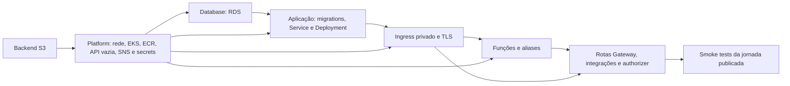
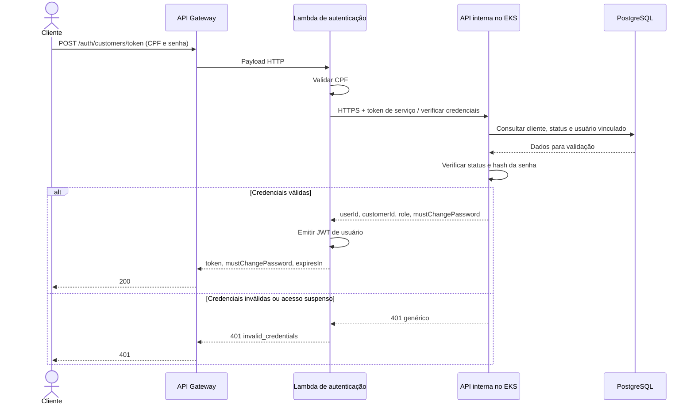
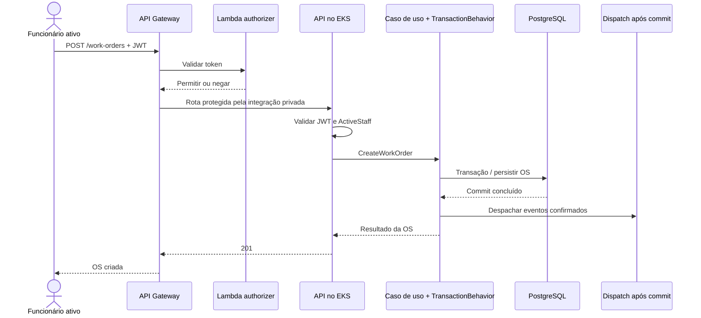

# RFC 0001 - Plataforma, repositórios e identidade da Fase 3

Data: 11/09/2026. Status: proposta de implementação da Fase 3; contratos revisados, implementação pendente.

Escopo: separação em quatro repositórios, infraestrutura como código, autenticação serverless por CPF, JWT, API Gateway e diagramas de integração previstos pelo Tech Challenge Fase 3. A direção arquitetural está registrada no [ADR 0001](../adrs/0001-four-repositories-on-aws-academy.md); a base executável e suas instruções estão no [README](../../../README.md). Este RFC especifica a evolução da solução e seus critérios de validação.

## Problema e resultado esperado

O GarageFlow reúne aplicação e infraestrutura em um repositório e um root module Terraform. A entrada atual é um Service LoadBalancer, o login usa e-mail/senha e o JWT é HS256. A nova fase exige quatro repositórios, autenticação de cliente por CPF em função serverless, Gateway e deploy automático por ambiente.

O resultado será uma plataforma com cada recurso sob um único dono, contratos publicados após deploy e uma jornada de autenticação que preserve os identificadores e as políticas existentes. Separar os repositórios não altera os limites dos módulos de negócio da aplicação.

## 1. Propriedade dos repositórios e recursos

| Repositório | Dono de | Não gerencia |
| --- | --- | --- |
| `GarageFlow` | Solution principal; Domain/Application/Adapters/Host; Dockerfile; testes; migrations EF; Deployment, Service interno/ClusterIP, ConfigMap e HPA da aplicação | Ciclo de vida de EKS, RDS, Gateway e funções |
| `garageflow-infra-kubernetes` | Backend S3 de estado e contratos; VPC e todas as subnets; EKS, ECR e SNS; secrets JWT, autenticação interna, bootstrap e webhook; ingress/controller/balanceador privado; API Gateway, VPC Link, rotas e authorizer de Gateway | Funções Lambda, RDS e migrations de negócio |
| `garageflow-infra-database` | Instância PostgreSQL, DB subnet group que referencia subnets da plataforma, SG do banco, secret do banco e política de backup | VPC/subnets, tabelas de negócio e migrations EF |
| `garageflow-serverless` | Solution independente; função de autenticação por CPF; função authorizer; testes; código e infraestrutura Lambda, aliases e permissões de invocação | Tabelas do domínio, recursos do Gateway e workloads da aplicação principal |

Todas as rotas e integrações do Gateway ficam no repositório de plataforma, inclusive a integração Lambda. O repositório serverless possui somente os recursos Lambda e suas permissões. Isso detalha a divisão inicial do roteiro e elimina dois states disputando o mesmo recurso de rota.

O `Host` continua como único executável da solution principal. O repositório serverless tem seu próprio composition root; nenhum `.csproj` usa `ProjectReference` para outro checkout. Contratos HTTP e manifests versionados são as interfaces entre repositórios.

## 2. Ambientes, states e ordem sem ciclos

Usar `develop` → `homologation` e `main` → `production`. Ambos têm configurações, credenciais/segredos, recursos e chaves de estado próprios. Não usar apenas stages diferentes do Gateway sobre o mesmo banco de produção. A capacidade da Academy ainda precisa ser comprovada para manter os dois ambientes simultaneamente.

Um bucket pode armazenar os states em chaves distintas:

| Root de execução | Repositório | Chave por ambiente | Consome |
| --- | --- | --- | --- |
| `platform` | infra Kubernetes | `phase3/{environment}/platform.tfstate` | Backend previamente inicializado e parâmetros Academy |
| `database` | infra banco | `phase3/{environment}/database.tfstate` | Contrato platform |
| `ingress` | infra Kubernetes | `phase3/{environment}/ingress.tfstate` | Contrato platform; Service da aplicação já criado |
| `serverless` | serverless | `phase3/{environment}/serverless.tfstate` | Contratos platform e ingress |
| `edge` | infra Kubernetes | `phase3/{environment}/edge.tfstate` | Contratos platform, ingress e serverless |

O root `platform` cria antecipadamente a HTTP API e os segredos comuns, sem rotas de negócio; seu ID é conhecido antes das permissões de invocação da Lambda. `edge` cria as rotas e integrações somente depois dos aliases Lambda. Nenhum recurso da HTTP API é recriado por `edge`.

Bootstrap inicial:

O pipeline da plataforma possui stages/jobs correspondentes, executados na ordem permitida pelos contratos já disponíveis. Na primeira implantação, pode requerer mais de uma execução automática conforme os outros repositórios publicam seus artefatos. Falta de pré-requisito deve aparecer como etapa bloqueada, nunca como deploy concluído. Nas atualizações, contratos e aliases estáveis permitem deploy independente; alteração incompatível exige sequência de migração explicitada no PR.

As rotas internas não dependem de um JWT de usuário nem da própria função de autenticação para validar uma chamada da função. Essa separação evita recursão no login.

## 3. Contrato de descoberta de infraestrutura

Cada root publica um JSON em S3 depois de `apply` e das verificações daquele root. Caminho: `contracts/v1/{environment}/{producer}.json`; `producer` é `platform`, `database`, `ingress` ou `serverless`. Bucket e região são parâmetros de bootstrap nos quatro repositórios.

Campos comuns: `schemaVersion` = `1.0`, `environment`, `producer`, `sourceCommit` (SHA Git), `publishedAt` (UTC/RFC3339) e `outputs` (objeto). O consumidor valida versão, produtor, ambiente e presença/tipo dos campos antes de implantar. Campo adicional opcional é compatível; remoção, mudança de tipo ou de significado exige nova versão principal. Publicar primeiro a cópia imutável em `contracts/v1/{environment}/{producer}/revisions/{sourceCommit}/{runId}-{runAttempt}.json` e depois atualizar o caminho estável, permitindo auditoria e retorno de configuração.

O [JSON Schema](../../../contracts/infra-contract-v1.schema.json) documenta o formato e o [validador/publicador Python](../../../scripts/infra_contract.py) é executado antes de consumir ou publicar um manifest. A execução do utilitário usa apenas a biblioteca padrão; as dependências adicionais são exclusivas dos testes. Os scripts de deploy mantêm manifests temporários e planos Terraform em `RUNNER_TEMP`.

| Produtor | Outputs obrigatórios | Consumidores |
| --- | --- | --- |
| platform | `awsRegion`, `vpcId`, `publicSubnetIds`, `privateApplicationSubnetIds`, `databaseSubnetIds`, `clusterName`, `clusterSecurityGroupId`, `ecrRepositoryUrl`, `apiGatewayId`, `apiGatewayExecutionArn`, `jwtSecretArn`, `internalAuthSecretArn`, `bootstrapSecretArn`, `webhookSecretArn`, `snsTopicArn` | database, aplicação, ingress, serverless, edge |
| database | `databaseHost`, `databasePort`, `databaseName`, `databaseSecretArn`, `databaseSecurityGroupId` | aplicação |
| ingress | `listenerArn`, `internalApiBaseUrl`, `tlsServerName` | serverless e edge |
| serverless | `customerAuthenticationAliasArn`, `requestAuthorizerAliasArn` | edge |

IDs, endpoints e ARNs são metadados; senhas, tokens, hashes e PEMs privados não entram no manifest. Consumidores recebem leitura dos contratos e acesso somente aos secrets necessários, sem exigir acesso ao arquivo completo do state de outro root. Políticas concretas precisam respeitar as roles disponíveis na Academy; restrições não verificadas não serão apresentadas como aplicadas.

## 4. Provisionamento temporário e transição da Fase 2

O ambiente Academy opera em sessões de quatro horas e é disponibilizado pela pipeline de provisionamento. A Fase 2 já fornece o workflow [Deploy AWS Academy](../../../.github/workflows/deploy-aws-academy.yml), com Terraform, publicação de imagem, migrations, deploy e smoke tests. A retomada parte desse fluxo existente com laboratório ativo, credenciais renovadas e backend S3 disponível; quando necessário, utiliza o [bootstrap de backend já fornecido](../../../infra/bootstrap/state-backend/main.tf). A ausência de recursos fora da sessão não exige redesenhar o provisionamento.

A Fase 3 distribui essa automação pelos novos donos de recursos. Antes de cada execução, conferir conta, inventário e state para escolher entre criação de um ambiente ausente e atualização dos recursos existentes. Transferência de propriedade de state só se aplica quando os recursos correspondentes existirem; não usar IDs históricos sem verificá-los.

Separar código não autoriza um `apply` que recrie a infraestrutura. Antes da transferência de propriedade:

1. Congelar os deploys do root antigo e verificar ausência de execuções concorrentes.
2. Listar os endereços e IDs reais dos recursos com credenciais válidas; fazer cópia protegida do state e snapshot do banco conforme a operação exigir.
3. Produzir tabela de endereço antigo → novo root/endereço. Rede/EKS/ECR/SNS e secrets de aplicação seguem para platform; RDS e secret do banco seguem para database; entrada nova segue para ingress/edge.
4. Preparar os destinos e os imports/transferências de state adequados à versão Terraform; revisar os planos do root de origem e de cada destino em conjunto.
5. Transferir cada recurso sem execução concorrente e sem dois states ativos capazes de gerenciá-lo. Conferir ausência de destroy/replacement não intencional e confrontar IDs/outputs com o inventário.
6. Publicar contratos, executar smoke tests, habilitar novos pipelines e desativar o deploy antigo que ainda controlava os recursos transferidos.

Os comandos definitivos de transferência dependem dos endereços reais do state remoto e dos planos revisados de origem e destino. O banco existente e seus dados devem ser preservados durante a transição, inclusive no laboratório temporário.

## 5. Autenticação do cliente

### Decisões propostas

- Receber **CPF e senha do portal**. CPF identifica o cadastro e a senha comprova a credencial já existente. OTP adicionaria entrega, expiração e retentativas e fica fora desta primeira implementação.
- Manter o login de funcionário em `/auth/login` com e-mail/senha.
- Exigir usuário de portal vinculado ao cliente. Um cadastro de cliente sem usuário de portal não recebe credenciais automaticamente; continua usando o fluxo existente de ativação do portal.
- Introduzir `CustomerStatus` com valores de contrato `Active` e `Suspended`. Regra no domínio; alteração por administrador, com evento e `UpdatedAt`. Migração dos clientes existentes para `Active` preserva comportamento atual. `MustChangePassword` continua separado.
- A função valida CPF e consulta um caso de uso privado da aplicação, que verifica cadastro/status/senha na base. Somente a função emite o JWT dessa jornada. A aplicação mantém a propriedade do algoritmo de hash e das invariantes.

### Interface pública

`POST /auth/customers/token`, atendido pela função de autenticação.

Entrada JSON: `cpf` (string), `password` (string). CPF aceita sua representação normalizada ou pontuada, validada por dígitos verificadores; CNPJ é rejeitado neste contrato. Não incluir CPF em URL, query string, logs ou dimensões de métricas. Limite de payload e throttling são aplicados na borda.

Saída `200`: `token` (string), `mustChangePassword` (boolean), `tokenType` = `Bearer`, `expiresIn` = 900 (segundos). Campos `token` e `mustChangePassword` mantêm o vocabulário existente.

| Condição | HTTP | Comportamento |
| --- | --- | --- |
| JSON malformado, CPF inválido ou campo obrigatório ausente | 400 | Problem Details sem dados de autenticação |
| Cliente inexistente/suspenso, portal ausente ou senha incorreta | 401 | Mesmo código de erro e mensagem externa: `invalid_credentials` |
| Throttling | 429 | Não encaminhar tentativas excedentes ao banco |
| Consulta interna indisponível ou timeout | 503 | `authentication_unavailable`, sem emitir token |

Não diferenciar mensagens externas para permitir enumeração de clientes. O verificador deve executar uma verificação de hash equivalente também nos caminhos sem usuário, para reduzir diferenças triviais de tempo; isso complementa throttling e não promete tempo de resposta perfeitamente constante.

### Interface privada da aplicação

`POST /internal/auth/customer-credentials/verify`, sem rota pública equivalente no API Gateway. Entrada: o mesmo `cpf` e `password`. Saída de sucesso: `userId` (UUID), `customerId` (UUID), `role` = `Customer`, `mustChangePassword` (boolean). Não retornar senha, hash ou token de usuário. Credenciais inválidas retornam `401` genérico. Esse caso de uso é leitura e não abre transação.

Consumidor: exclusivamente a função de autenticação. Transporte HTTPS com validação de certificado e nome do servidor. Service identity: JWT de serviço assinado com **secret próprio**, diferente da chave de usuários, `iss` = `GarageFlow.Serverless`, `aud` = `GarageFlow.InternalAuth`, `sub` = `customer-auth-function`, `scope` = `customer-credentials:verify`, validade máxima de 60 segundos e algoritmo permitido HS256. A API usa esquema/política específicos para esse endpoint. JWT de cliente/funcionário não satisfaz essa política; token interno não autentica rotas de negócio.

A implementação TLS e a conexão ao serviço privado são pré-requisitos do ingress na Academy. A fundação adota um único listener HTTPS compartilhado pela função e pela integração privada do HTTP API Gateway. Seu certificado deve apresentar uma cadeia confiável pelo API Gateway, e a função mantém a validação TLS normal. Antes do deploy, é necessário comprovar na Academy o domínio sob propriedade/controle do projeto, validar que `tlsServerName` corresponde a esse nome e ao certificado e confirmar que o certificado é compatível com o Gateway. O manifest não configura uma trust store do Gateway. Não desabilitar validação de certificado como atalho. Sem esses pré-requisitos, transporte seguro e ingress privado demonstrados, M2 não está concluído. Referência: [AWS - configuração TLS de integração](https://docs.aws.amazon.com/apigateway/latest/developerguide/api-gateway-extensions-integration-tls-config.html).

As subnets privadas atuais não têm saída NAT definida. A função em VPC precisa de conectividade planejada para buscar secrets e para as integrações que usar: endpoints privados dos serviços suportados ou egress controlado conforme permitido no laboratório. Colocar uma Lambda em subnet pública, por si só, não lhe dá acesso à internet. Essa dependência entra no preflight de rede; o contrato não pressupõe que uma chamada ao Secrets Manager funcionará somente por atribuir subnets à função. Referência: [AWS - Lambda e VPC](https://docs.aws.amazon.com/lambda/latest/dg/configuration-vpc.html).

### JWT de usuário e Gateway

Para a primeira entrega, manter **HS256 e Lambda authorizer**. Essa opção preserva compatibilidade com os tokens atuais de funcionários. A alternativa RSA/JWKS com authorizer nativo reduz código de validação na borda, mas exige mudar emissão/descoberta/rotação das chaves e a coexistência dos emissores; pode ser adotada em uma decisão posterior.

O repositório serverless terá duas funções com responsabilidades distintas: emissão após CPF/senha e validação de tokens para o Gateway. Compartilhar a biblioteca interna de validação somente dentro desse repositório. SDKs AWS permanecem nos adapters.

Contrato do JWT do cliente:

| Campo | Valor/regra |
| --- | --- |
| Algoritmo | Somente HS256, chave aleatória por ambiente obtida do Secrets Manager |
| `iss` / `aud` | Configurados pelo mesmo contrato de ambiente usado no Host; preservam `GarageFlow` / `GarageFlow.Adapters.Api` na migração inicial |
| `sub` | UUID do **User**, nunca CPF ou UUID do Customer |
| `customer_id` | UUID do Customer vinculado |
| `role` | `Customer`; API mapeia para sua política de papel existente |
| `must_change_password` | Strings `true` ou `false`, compatíveis com as políticas atuais |
| `iat`, `nbf`, `exp` | UTC; validade de 15 minutos; verificações de tempo em ambos os validadores |
| `jti` | Identificador único de emissão |

Uma senha temporária permite obter o token restrito e chamar a troca de senha, preservando o fluxo atual. Enquanto `must_change_password=true`, as políticas de usuário ativo continuam negando rotas de negócio. Após a troca, novo login é necessário. Cliente suspenso não obtém novo token e as rotas de cliente consultam status atual no caso de uso de acesso; suspensão não depende somente da expiração do JWT.

Configurar Lambda authorizer REQUEST com payload 2.0, identidade no header `Authorization` e cache de decisão desabilitado inicialmente. Validar algoritmo, assinatura, emissor, audiência, validade e formato do sujeito; rejeitar por padrão. A API repete a validação de JWT e aplica perfil, senha temporária e propriedade da OS. Não confiar em headers de identidade fornecidos pelo cliente.

Antes do deploy, testar a mesma coleção de tokens válidos/inválidos contra ambos os validadores. A política de rotação de HS256 deve prever chaves corrente/anterior com identificador e uma janela limitada à validade máxima dos tokens ainda emitidos, incluindo os de funcionários; até implementar essa compatibilidade, rotação de chave implica novo login e deve ser coordenada entre funções e Host.

Referências: [JWT authorizer nativo e RSA](https://docs.aws.amazon.com/apigateway/latest/developerguide/http-api-jwt-authorizer.html), [Lambda authorizers para HTTP API](https://docs.aws.amazon.com/apigateway/latest/developerguide/http-api-lambda-authorizer.html).

## 6. Sequências e autorização das jornadas

A abertura de OS permanece autorizada para **funcionário ativo**. O token CPF de cliente dá acesso às suas próprias OS e às decisões de orçamento; não concede abertura/gestão administrativa.

Os eventos de mudança de status usam o outbox existente para SNS; a sequência de criação não afirma que todo evento de criação já é uma notificação SNS. Na documentação final, incluir caminhos de 400/401/403/404/409 e indisponibilidade conforme os contratos implementados.

Matriz de exposição: `/auth/login` e `/auth/customers/token` são públicas com throttling; rotas de negócio passam pelo authorizer e pelas políticas da API; troca de senha exige token mas não a política de senha já alterada; webhook conserva HMAC próprio; probes internos não são endpoints de negócio; `/internal/*` nunca é publicado por wildcard. Enumerar rotas explicitamente no root edge e testar ausência de bypass.

## 7. GitHub e entrega automática

Em cada repositório, CI executa em PR; deploy executa após merge em `develop` e `main`, com Environment correspondente e concurrency por ambiente/root. Não exigir o input manual `APPLY` para o caminho de deploy normal. Operações destrutivas continuam em workflow separado, nunca no deploy automático.

Proteger `main` e `develop`: exigir PR e os checks que realmente existirem no repositório, bloquear force-push/deleção e aplicar regras também a administradores. O PDF exige PR; não exige um número específico de aprovações. Proposta inicial para permitir trabalho individual: zero aprovações de terceiros, preservando PR e CI obrigatórios. Não cadastrar nome de check que ainda não tenha sido executado pelo novo workflow.

Aplicar as proteções após preparar os pipelines e verificar via API que PR, checks e restrições de branch estão efetivos nos quatro repositórios. Um Environment nomeado, isoladamente, não comprova proteção.

Credenciais temporárias da Academy devem ser atualizadas nos ambientes correspondentes. Um preflight STS verifica expiração antes de criar plano/artefato e apresenta erro claro. O plano não pressupõe que OIDC ou criação de roles estejam liberados no laboratório.

As credenciais e o ambiente têm duração de quatro horas. Preparar os artefatos antes da sessão, conferir o tempo restante e provisionar pela pipeline quando for necessário usar o ambiente. Na retomada, verificar inventário e backend antes de executar os roots; repetir smoke tests após o provisionamento. Relatórios intermediários e registros de execução ficam fora do repositório.

## 8. Critérios de validação

Validar a implantação durante uma sessão ativa da Academy. O ambiente deve subir pelas pipelines, com states sob donos únicos, contratos compatíveis, conectividade privada, HTTPS validado e capacidade para os ambientes isolados. Consultas e simulações de permissões apoiam o diagnóstico; a execução e os smoke tests verificam o caminho completo.

Entregar quatro repositórios com políticas verificadas e CI/CD reproduzível. Cobrir domínio/status do cliente, consulta privada, contrato HTTP, JWT entre emissores/validadores, autorização, migrations em PostgreSQL e jornada real pelo Gateway. A existência deste RFC não substitui essas verificações.

Pontos que invalidam a opção de infraestrutura e exigem revisão: impossibilidade de configurar o ingress privado/TLS, ausência das permissões Lambda/VPC/PassRole necessárias, ou quota incapaz de suportar os ambientes exigidos. Não substituir silenciosamente banco isolado por compartilhado ou entrada privada por balanceador público.
