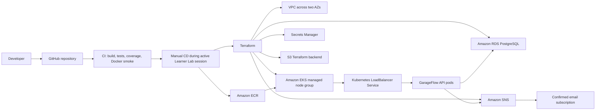
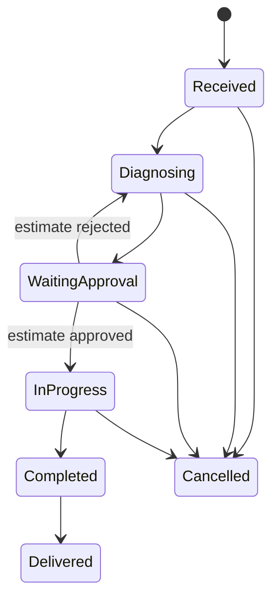
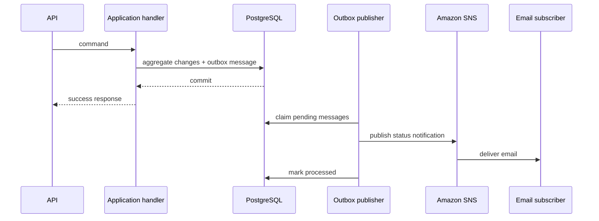

# GarageFlow Phase 2 AWS Academy Delivery Design

**Date:** 2026-07-11
**Status:** Draft for written review; all design sections approved
**Scope:** Tech Challenge Phase 2 functional compliance, resilience, Kubernetes, Terraform, CI/CD, documentation, and demonstration.

## 1. Context and objective

GarageFlow already has a strong Clean Architecture and DDD foundation, with explicit API and infrastructure adapters, vertical slices, a single Host composition root, automated tests, Docker, PostgreSQL, and a CI quality gate. Phase 2 evolves that foundation to meet the supplied Tech Challenge requirements for functional completeness, resilience, elasticity, infrastructure automation, and demonstrable deployment.

The target is an ephemeral AWS Academy Learner Lab environment. The environment is created for development or demonstration and destroyed on the same day. The design prioritizes rubric coverage, reproducibility, low operational risk, and controlled cost over production-scale availability.

## 2. Requirements covered

The design covers every mandatory Phase 2 requirement:

- Preserve and complete the Clean Architecture refactor.
- Keep automated coverage for critical flows.
- Open a work order using existing IDs.
- Open a work order using one complete nested payload that registers all required data.
- Query work-order status.
- Receive external estimate approval or rejection.
- List active work orders by prescribed status priority and age.
- Notify work-order status changes by email.
- Build and run the application with Docker and Docker Compose.
- Deploy with Kubernetes Deployment, Service, ConfigMap, Secret, and HPA.
- Provision the Kubernetes cluster and database with Terraform.
- Run build, tests, image publication, database deployment, and Kubernetes deployment through CI/CD.
- Update the README, architecture diagrams, API collection, video, and final delivery PDF.

## 3. Existing baseline and identified gaps

The existing project boundaries match the required dependency direction:

```text
Host
|-- Adapters.Api -----------> Application ---> Domain ---> SharedKernel
|-- Adapters.Infrastructure -> Application
|                            -> Domain
|                            -> SharedKernel
`-- SharedKernel
```

The baseline already includes 61 Minimal API endpoints and matching application handlers, domain value objects and events, EF Core mappings, Docker Compose, unit/integration/E2E projects, architecture tests, coverage enforcement, and Sonar analysis.

The Phase 2 gaps are:

- The current work-order opening only receives customer and vehicle IDs.
- The active work-order list does not apply the prescribed status ranking or exclusions.
- The current `Approved` work-order state is not part of the required lifecycle.
- Estimate approval/rejection is only available through authenticated customer routes, not an external notification endpoint.
- Email delivery is simulated by logging and only covers the approval request.
- There is no durable outbox for failed external notifications.
- Kubernetes manifests and Terraform do not exist.
- The current workflow is CI only; it does not publish an image or deploy.
- Current E2E tests exercise a real Host and PostgreSQL but not the built Docker image.
- The README still identifies the project as a Phase 1 delivery.

## 4. Approved architectural approach

The selected approach is a managed, ephemeral AWS deployment:



### 4.1 AWS Academy constraints

- Region: `us-east-1`.
- Authentication: temporary Learner Lab credentials refreshed before each CD run.
- IAM: reuse the EKS roles supplied by the lab; do not create arbitrary IAM users or roles.
- EC2: two small on-demand worker nodes, within the lab instance and vCPU limits.
- RDS: PostgreSQL, Single-AZ, small burstable class, general-purpose storage, no Enhanced Monitoring.
- ECR: the deploy workflow uses the temporary learner identity that has write access; EKS nodes only require pull access.
- SNS: standard topic with a manually confirmed email subscription.
- Cost control: no NAT Gateway, no Multi-AZ RDS, no always-on environment, and an explicit destroy workflow.

Amazon EKS has a per-cluster hourly charge in addition to its worker and networking resources, which reinforces the same-day destroy policy. See [Amazon EKS pricing](https://aws.amazon.com/eks/pricing/). Managed node groups automate the EC2 node lifecycle while charging only for the underlying resources. See [EKS managed node groups](https://docs.aws.amazon.com/eks/latest/userguide/managed-node-groups.html).

## 5. Functional design

### 5.1 Work-order lifecycle

The domain lifecycle is aligned with the statuses required by the challenge:



Changes to the current model:

- Rename `Created` to `Received` in the domain and persisted string value.
- Remove `Approved` as a work-order status.
- Approval transitions directly from `WaitingApproval` to `InProgress`.
- Rejection transitions from `WaitingApproval` back to `Diagnosing` so a new estimate can be prepared.
- Remove the redundant `StartWork` endpoint and use case.
- Keep `Cancelled` as an exceptional terminal state outside the required happy-path lifecycle.
- Add a migration that updates persisted work-order status strings from `Created` to `Received` and from `Approved` to `InProgress`. Estimate status `Approved` remains unchanged.
- Set `StartedAt` when approval moves the work order to `InProgress`.
- Restore inventory quantities reserved by a rejected estimate or cancelled work order exactly once, in the same application transaction as the state change.

Every transition updates `UpdatedAt` and raises `WorkOrderStatusChanged`.

The README and API documentation map the English code contract to the rubric terminology: `Received` = Recebida, `Diagnosing` = Diagnóstico, `WaitingApproval` = Aguardando Aprovação, `InProgress` = Execução, `Completed` = Finalizada, and `Delivered` = Entregue.

### 5.2 Existing opening endpoint

`POST /work-orders` remains available and keeps its current purpose:

```json
{
  "customerId": "uuid",
  "vehicleId": "uuid"
}
```

The handler validates that both aggregates exist and that the vehicle belongs to the customer, creates the work order with status `Received`, and returns `201 Created` with its unique ID.

### 5.3 Complete intake endpoint

Add `POST /work-orders/intake` for the all-in-one registration required by the challenge.

Representative request:

```json
{
  "requestId": "uuid",
  "customer": {
    "taxDocument": "12345678901",
    "fullName": "Maria Oliveira",
    "email": "maria@example.com",
    "phoneNumber": "+5511999999999"
  },
  "vehicle": {
    "plate": "ABC1D23",
    "year": 2022,
    "brand": "Toyota",
    "model": "Corolla",
    "color": "Black"
  },
  "services": [
    {
      "description": "Oil and filter replacement",
      "price": 180.00
    }
  ],
  "inventoryItems": [
    {
      "name": "5W30 engine oil",
      "description": "Synthetic engine oil",
      "type": "Part",
      "cost": 35.00,
      "price": 55.00,
      "stockQuantity": 10,
      "quantity": 4
    }
  ]
}
```

The application use case orchestrates existing module ports but does not move business invariants out of the domain. In one transaction it:

1. Validates the request and idempotency key.
2. Rejects an existing customer tax document or vehicle plate with `409 Conflict`.
3. Resolves or creates vehicle brand, model, and color by their normalized reference names.
4. Creates the customer and vehicle.
5. Creates each supplied service and inventory item using the corresponding domain factories.
6. Creates the work order and its initial draft estimate.
7. Adds service and inventory lines using domain snapshots.
8. Decreases newly created inventory stock by the quantity reserved for the estimate; `stockQuantity` must cover `quantity`.
9. Stores the idempotency receipt and response data.
10. Returns `201 Created` with the work-order ID and created aggregate IDs.

The complete intake is intentionally the create-new flow. Known customers, vehicles, services, or inventory items continue through the ID-based endpoints. Brand, model, and color are the only shared reference dictionaries resolved by name because their uniqueness is already part of the current model.

Request rules are explicit:

- `services` must contain at least one entry; `inventoryItems` may be empty because some work orders require no parts.
- Duplicate services or inventory items inside the same payload are rejected.
- `type` is an API-owned string contract and is translated to the domain enum in Application. The existing inventory creation endpoint is aligned to the same string contract while this area is touched.
- All prices, costs, quantities, names, descriptions, contact data, vehicle data, and tax documents are validated by the existing value objects.
- Staff authorization is required for both work-order opening endpoints.

Successful response:

```json
{
  "workOrderId": "uuid",
  "customerId": "uuid",
  "vehicleId": "uuid",
  "estimateId": "uuid",
  "serviceIds": ["uuid"],
  "inventoryItemIds": ["uuid"],
  "status": "Received",
  "createdAt": "2026-07-11T20:00:00Z"
}
```

The first successful request returns `201 Created` with `Location: /work-orders/{workOrderId}`.

If any creation, invariant, stock reservation, or persistence operation fails, the transaction rolls back all changes.

Inventory reservation remains consistent across the lifecycle: adding an estimate inventory line reserves stock; rejecting that estimate or cancelling the work order releases each outstanding reservation once; approved/executed lines are not released. Application coordinates the WorkOrders and InventoryItems aggregates inside the same transaction, while each aggregate keeps its own invariants.

### 5.4 Intake idempotency

`requestId` is a required UUID. Infrastructure stores an `IntakeRequestReceipt` with a unique request ID, canonical payload hash, work-order ID, serialized response, and completion timestamp.

- First request: process and return `201 Created`.
- Same request ID and same payload: return `200 OK` with the stored response without creating data again.
- Same request ID and different payload: return `409 Conflict`.
- Concurrent requests rely on the database unique constraint and reload the winning receipt.

### 5.5 Status query

Add `GET /work-orders/{id}/status` as a focused, side-effect-free query returning:

```json
{
  "id": "uuid",
  "status": "WaitingApproval",
  "updatedAt": "2026-07-11T20:00:00Z"
}
```

Existing detail endpoints remain unchanged except for the renamed public statuses.

The staff route uses the existing staff authorization policy. Authenticated customers continue to access the status through their `/me/work-orders/{id}` detail route, which already enforces ownership.

### 5.6 Operational list

`GET /work-orders` becomes the active operational queue. Infrastructure projects and orders in the database using this priority:

1. `InProgress`
2. `WaitingApproval`
3. `Diagnosing`
4. `Received`

Within each status, older `CreatedAt` values come first and the ID is the deterministic tie-breaker. `Completed`, `Delivered`, and `Cancelled` work orders are excluded from the active queue. Existing pagination and customer filtering remain supported.

The operational queue remains a staff-authorized route.

### 5.7 External estimate-decision webhook

Add `POST /webhooks/estimate-decisions` while retaining the authenticated customer approve/reject endpoints.

Request body:

```json
{
  "eventId": "uuid",
  "workOrderId": "uuid",
  "estimateId": "uuid",
  "decision": "Approved",
  "occurredAt": "2026-07-11T20:00:00Z"
}
```

Headers:

- `X-GarageFlow-Timestamp`: Unix timestamp.
- `X-GarageFlow-Signature`: lowercase hexadecimal HMAC-SHA256 over `<timestamp>.<raw-body>`.

Rules:

- The shared HMAC secret comes from a Kubernetes Secret.
- Signature comparison is constant-time.
- The accepted clock skew is five minutes.
- Invalid or expired signatures return `401 Unauthorized`.
- An inbox table has a unique `eventId` and payload hash.
- A repeated event with the same hash returns `204 No Content` without repeating the transition.
- A repeated event ID with a different payload returns `409 Conflict`.
- A valid new event executes the domain transition and records the inbox entry in the same transaction.

HTTP signature extraction belongs to the API adapter; decision validation and orchestration belong to Application; transition invariants remain in Domain; inbox persistence belongs to Infrastructure.

## 6. Reliable status notifications

The current fire-and-forget post-commit email handler is replaced by a transactional integration outbox.



The transaction pipeline keeps the current GarageFlow contract: it saves domain changes, dequeues domain events before commit, maps and persists integration outbox messages with a second unit-of-work save, commits, and then dispatches those domain events after commit. Before commit, an `IIntegrationOutboxMapper` maps integration-relevant events such as `WorkOrderStatusChanged` to durable outbox messages and an `IOutboxWriter` persists them in the same transaction. Post-commit Mediator dispatch therefore remains intact, while SNS delivery becomes durable and eventual through an infrastructure-hosted publisher. Outbox records use stable event keys rather than CLR assembly-qualified type names.

The existing logging approval-email handler is removed. Status notification delivery is owned only by the outbox publisher, preventing duplicate email paths.

The publisher:

- Claims batches safely across multiple pods using PostgreSQL row locking and leases.
- Publishes status messages through an Application port implemented by the SNS adapter.
- Records `AttemptCount`, `NextAttemptAt`, `ProcessedAt`, and a bounded `LastError`.
- Retries with exponential backoff.
- Leaves failed messages pending instead of losing them.
- Emits structured logs with the event, work-order, and correlation IDs.

The SNS email contains the work-order ID, previous status, current status, and occurrence time. Email subscriptions must be manually confirmed before the demonstration, as required by [Amazon SNS email subscription confirmation](https://docs.aws.amazon.com/sns/latest/dg/sns-create-subscribe-endpoint-to-topic.html).

## 7. Error and consistency contracts

- `400 Bad Request`: malformed input or invalid value object.
- `401 Unauthorized`: missing, invalid, or expired webhook signature.
- `403 Forbidden`: authenticated principal lacks the required policy.
- `404 Not Found`: referenced aggregate or estimate does not exist.
- `409 Conflict`: duplicate natural key, reused idempotency key with different payload, duplicate external event with different payload, insufficient stock, or prohibited state transition.
- `500 Internal Server Error`: generic response with no internal detail; full context is logged.

All mutating use cases continue through `TransactionBehavior`; handlers never begin or commit transactions manually.

## 8. AWS infrastructure design

### 8.1 Network

- One VPC spanning two availability zones.
- One public subnet per AZ for the managed EKS worker nodes and internet-facing load balancer.
- One private database subnet per AZ for the RDS subnet group.
- Internet Gateway for the public subnets.
- Public subnets explicitly enable public IPv4 assignment for the lab worker nodes so they can reach ECR without a NAT Gateway.
- No NAT Gateway.
- RDS has no public endpoint.
- Security groups allow PostgreSQL port 5432 only from the EKS node/pod network path.
- The public API is a lab-only endpoint and must use synthetic demonstration data. Production TLS and custom-domain design are explicitly outside this phase.

### 8.2 EKS

- Standard-support Kubernetes version pinned through an environment variable after a lab preflight verifies availability.
- Learner Lab cluster and node roles supplied as Terraform inputs.
- One managed node group spanning both public subnets.
- Two on-demand `t3.small` nodes: minimum 2, desired 2, maximum 2.
- No Cluster Autoscaler in this phase; the required elasticity is pod-level HPA.
- Metrics Server installed as part of the cluster deployment because EKS HPA requires a metrics source. See [Amazon EKS HPA guidance](https://docs.aws.amazon.com/eks/latest/userguide/horizontal-pod-autoscaler.html).

### 8.3 RDS

- PostgreSQL compatible with the application's Npgsql provider.
- `db.t3.micro`, Single-AZ.
- 20 GB `gp2` storage.
- Private subnet group and no public access.
- Enhanced Monitoring disabled to comply with Learner Lab restrictions.
- Deletion protection disabled and final snapshot skipped only for this ephemeral lab environment.

Single-AZ is an intentional lab trade-off; RDS supports choosing a single DB instance deployment. See [Creating an RDS DB instance](https://docs.aws.amazon.com/AmazonRDS/latest/UserGuide/USER_CreateDBInstance.html).

### 8.4 Regional services

- ECR repository with immutable SHA-based image tags and forced deletion for lab teardown.
- SNS standard topic and email subscription.
- Secrets Manager entries for generated database, JWT, bootstrap admin, and webhook secrets.
- S3 backend bucket with encryption, versioning, public access blocking, and native lockfile-based state locking.

The S3 state bucket is a small bootstrap resource retained between sessions so a later destroy workflow can access the state. It is not a running compute resource. HashiCorp recommends bucket versioning for state recovery and supports `use_lockfile = true` for native S3 state locking. See [Terraform S3 backend](https://developer.hashicorp.com/terraform/language/backend/s3).

The bootstrap is a documented one-time operation. It starts with local state, creates the backend bucket, enables versioning/encryption/public-access blocking, and then migrates its own state into that bucket. Subsequent deploy and destroy workflows use the remote backend directly. Local Terraform state files are ignored and never committed.

Generated secret values can appear in Terraform state by design; the backend is therefore encrypted, private, versioned, and never uploaded as a CI artifact or printed in workflow output.

## 9. Terraform layout

```text
infra/
|-- bootstrap/
|   `-- state-backend/
|-- environments/
|   `-- academy/
|       |-- backend.tf
|       |-- main.tf
|       |-- providers.tf
|       |-- variables.tf
|       |-- outputs.tf
|       `-- terraform.tfvars.example
`-- modules/
    |-- network/
    |-- eks/
    |-- rds/
    |-- ecr/
    |-- sns/
    `-- secrets/
```

Terraform versions and providers are pinned. Credentials are supplied through environment variables and never written to backend configuration, plans, variable files, or the repository.

Every resource is tagged with project, phase, environment, owner, and expiration intent.

## 10. Kubernetes design

```text
k8s/
|-- namespace.yaml
|-- configmap.yaml
|-- secret.template.yaml
|-- migration-job.yaml
|-- deployment.yaml
|-- service.yaml
|-- hpa.yaml
`-- kustomization.yaml
```

### 10.1 Deployment

- Two initial replicas.
- Rolling update with no simultaneous full outage.
- Startup, readiness, and liveness probes.
- Graceful termination.
- CPU request 100m and limit 500m.
- Memory request 128 MiB and limit 512 MiB.
- `Database__AutoMigrate=false` on application pods.
- Image tag injected from the immutable Git commit SHA.

### 10.2 Database migration job

The Host gains a runtime-only `--migrate-only` mode. A Kubernetes Job uses the same application image to apply EF Core migrations and exits. The deployment workflow waits for this Job and stops before rollout if it fails. This prevents concurrent migration attempts from multiple replicas.

### 10.3 Configuration and secrets

- ConfigMap stores non-sensitive runtime configuration.
- `secret.template.yaml` contains variable placeholders only.
- The deploy workflow reads secret values from GitHub environment secrets and AWS Secrets Manager and generates the applied Kubernetes Secret without writing rendered values to disk artifacts or Git.
- Temporary AWS credentials are injected only because the Learner Lab cannot support the normal production OIDC/Pod Identity setup. The environment is destroyed before those credentials expire.

### 10.4 HPA

- API version `autoscaling/v2`.
- Minimum 2 pods, maximum 6 pods.
- Target average CPU utilization 60%.
- Target average memory utilization 70%.
- Explicit scale-up and scale-down behavior suitable for a short demonstration.
- Metrics Server is validated before the HPA is applied.

## 11. CI/CD design

### 11.1 Continuous integration

The existing quality gate is retained and corrected:

1. Pin the .NET SDK with `global.json`, then restore and build the full solution with zero warnings.
2. Run architecture tests.
3. Run unit tests.
4. Run integration tests.
5. Run E2E/Testcontainers once rather than in two duplicate jobs.
6. Enforce aggregate coverage of at least 80% with corrected adapter exclusion paths.
7. Build the Docker image.
8. Start the built image against PostgreSQL and run container-level health, OpenAPI, and minimal journey smoke tests.
9. Validate Docker Compose configuration.
10. Run Terraform format and validation.
11. Validate Kubernetes manifests without applying them.

The E2E suite shares one PostgreSQL Testcontainer through an xUnit collection fixture and avoids uncontrolled parallel container creation across test classes.

No AWS credentials are needed for pull-request CI.

### 11.2 Manual deployment

`.github/workflows/deploy-aws-academy.yml` uses `workflow_dispatch` and a protected GitHub Environment.

1. Validate temporary AWS credentials with STS.
2. Confirm region and caller identity.
3. Initialize the S3 Terraform backend.
4. Run Terraform validate, plan, and apply.
5. Authenticate to ECR.
6. Build and push the application image tagged with the Git SHA.
7. Update kubeconfig.
8. Apply Metrics Server and wait for availability.
9. Generate and apply Kubernetes configuration and Secret.
10. Run and wait for the database migration Job.
11. Apply Deployment, Service, and HPA.
12. Wait for rollout and the external endpoint.
13. Execute post-deploy health, OpenAPI, authentication, and work-order smoke tests.

### 11.3 Manual destruction

`.github/workflows/destroy-aws-academy.yml` uses `workflow_dispatch` and explicit GitHub Environment approval.

1. Validate caller identity and region.
2. Initialize the existing backend.
3. Run `terraform destroy` for the environment.
4. Verify that EKS, EC2 workers, RDS, ECR repository, SNS topic, Secrets Manager entries, load balancer, and VPC resources are gone.
5. Retain only the versioned S3 state bucket bootstrap unless the team explicitly performs final cleanup.

## 12. Testing strategy

### 12.1 Domain tests

- Exact work-order transition matrix.
- Approval to `InProgress` and rejection to `Diagnosing`.
- Removal of `Approved` and prevention of invalid transitions.
- Domain events and timestamps for every transition.
- Intake-created estimate snapshots and stock invariants.

### 12.2 Application tests

- Existing ID-based opening success and failures.
- Complete intake success.
- Rollback when any nested creation or stock reservation fails.
- First request, safe retry, payload mismatch, and concurrent idempotency behavior.
- Operational-list pagination, filtering, priority, age ordering, and terminal-state exclusion.
- Focused status query.
- Valid, invalid, expired, duplicated, and conflicting webhook events.
- Inbox atomicity.
- Outbox persistence, retry scheduling, and multi-worker claiming.

### 12.3 Integration tests

- API status codes, authorization policies, payload shapes, and ProblemDetails.
- EF query translation for status-ranking `CASE` expressions.
- Unique constraints for request IDs and external event IDs.
- SNS adapter contract with a controlled client.
- Migration from current status values.

### 12.4 E2E and delivery tests

- Full Host and real PostgreSQL journey for both opening endpoints.
- Estimate submit, external approve/reject, execution, completion, and delivery.
- Inventory reservation and exact stock restoration after rejection or cancellation.
- Status-list ordering with mixed work orders.
- Outbox publication lifecycle.
- Built Docker image startup and migrations.
- Post-deploy AWS smoke journey.
- k6 load profile and observable HPA scale-out/scale-in.

Before completion, run every mandatory command from `AGENTS.md`, including the E2E and full-solution runs with Docker available.

## 13. Load and HPA demonstration

Add a versioned k6 script under `scripts/load-test/` that authenticates once per virtual user and repeatedly exercises active work-order list and status queries.

Demonstration sequence:

1. Show two ready API pods.
2. Run `kubectl get hpa,pods -w`.
3. Ramp k6 load gradually.
4. Show CPU or memory crossing the HPA target.
5. Show the Deployment scaling from two toward at most six pods.
6. Stop the load.
7. Show the configured scale-down returning to two pods.

The load test has bounded duration and thresholds for HTTP error rate and response latency. It uses synthetic data only.

## 14. Observability and security

- Structured application logs to stdout.
- Correlation through `requestId`, `eventId`, `workOrderId`, and outbox message ID.
- Probe and rollout status visible through Kubernetes.
- `kubectl logs`, `kubectl events`, `kubectl top`, and GitHub Actions logs form the lab observability surface.
- No secrets in logs, source, manifests, Terraform variable examples, plans, or uploaded artifacts.
- RDS is private and restricted by security group.
- Webhook HMAC validation and replay window are mandatory.
- Unexpected HTTP errors remain generic.
- The public HTTP endpoint is for short-lived synthetic-data demonstration only. A production custom domain, trusted TLS termination, WAF, durable IAM federation, Multi-AZ database, and long-term monitoring are explicit non-goals for the Learner Lab delivery.

## 15. Documentation and deliverables

Update `README.md` with:

- Phase 2 objectives and architecture.
- Application, AWS, Kubernetes, database, and deploy-flow diagrams.
- Local Docker Compose instructions.
- Terraform bootstrap/apply/destroy instructions.
- Kubernetes deployment and troubleshooting instructions.
- AWS Academy credential refresh and budget precautions.
- API and Scalar URLs.
- Link to a committed Postman collection.
- Link to the demonstration video.
- Explicit cleanup checklist.

Add or update:

- `/k8s` manifests.
- `/infra` Terraform.
- CI, deploy, and destroy workflows.
- Postman collection covering both opening endpoints, status, list, and webhook.
- Rendered architecture diagram for README and final PDF.
- Final PDF with repository link, architecture, and video link.
- Repository access for user `soat-architecture`.

Suggested video sequence, within 15 minutes:

1. Explain architecture and trigger the deploy workflow.
2. Show the provisioned EKS, RDS, and ECR resources.
3. Exercise both work-order opening endpoints.
4. Query status and the ordered active queue.
5. Demonstrate the signed external decision and SNS email.
6. Run k6 and show HPA scale-out and recovery.
7. Show the protected destroy workflow and cleanup evidence.

## 16. Non-goals

- Permanent or production AWS hosting.
- Multi-AZ RDS or cross-region disaster recovery.
- Kubernetes node autoscaling.
- Production OIDC, IRSA, or EKS Pod Identity setup unavailable under the lab IAM model.
- Custom DNS and publicly trusted TLS certificate.
- Full CloudWatch Container Insights stack.
- A user-facing frontend.
- Unrelated refactors outside touched Phase 2 paths.

## 17. Acceptance criteria

The design is implemented when all of the following are true:

- Both work-order opening endpoints are documented and pass automated tests.
- Complete intake is atomic, idempotent, and returns the unique work-order ID.
- Required status lifecycle and active-list order are exact.
- External approval/rejection is HMAC-protected, replay-resistant, and idempotent.
- Status changes are durably delivered through outbox and SNS email.
- Docker image and Compose startup are validated.
- Terraform provisions EKS, RDS, ECR, SNS, secrets, and networking in AWS Academy.
- Kubernetes manifests include Deployment, Service, ConfigMap, Secret template, migration Job, and HPA.
- CI validates code, tests, coverage, Docker, Terraform, and Kubernetes.
- Manual deploy and destroy workflows work with refreshed Learner Lab credentials.
- The k6 demonstration visibly scales pods and returns them to the minimum.
- README, collection, diagrams, video link, and final PDF are complete.
- All mandatory solution builds and tests pass.

## 18. Implementation decomposition

Implementation should be planned as five ordered subprojects, each independently verifiable:

1. Functional compliance: statuses, complete intake, status query, and active-list ordering.
2. Integration reliability: signed webhook, inbox, outbox, and SNS adapter.
3. Container and Kubernetes runtime: migration mode, image smoke test, manifests, probes, and HPA.
4. AWS infrastructure and CD: Terraform, ECR publication, deploy, smoke, and destroy.
5. Delivery assets: README, Postman collection, diagrams, load script, video guide, and final PDF checklist.

This is intentionally one phase-level architecture specification because the lifecycle, outbox, Kubernetes runtime, Terraform, and CI/CD decisions constrain one another. The implementation plan must preserve the five checkpoints above so each subproject can be reviewed and verified before the next begins.

The detailed implementation plan is intentionally deferred until this specification is reviewed and approved in its committed form.
